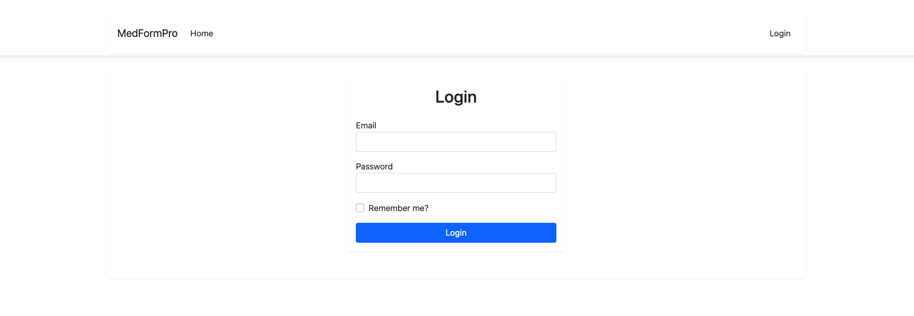
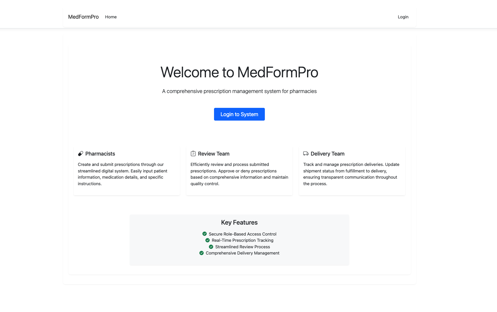
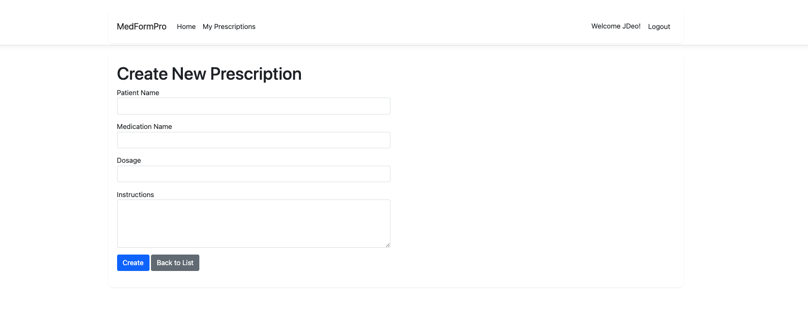
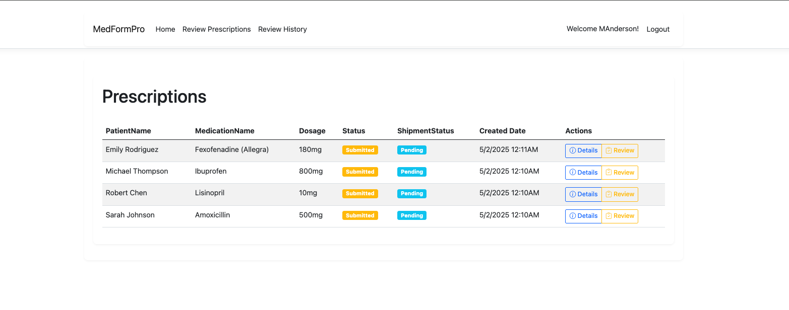
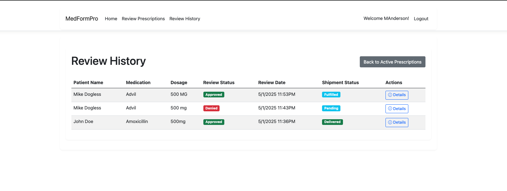
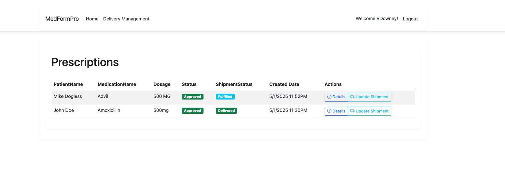
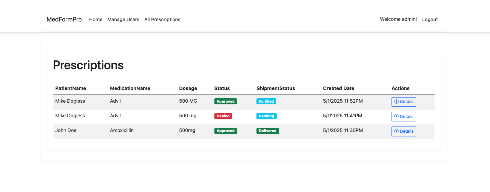

# MedForm Pro - Prescription Management System

MedForm Pro is a comprehensive web-based prescription management system built with ASP.NET Core MVC. It facilitates the entire prescription lifecycle, from creation to delivery, with role-based access control and a streamlined workflow.

## Quick Start Guide

### Default Admin Account



To access the system as an administrator:

- Email: admin@medformpro.com
- Password: Admin123!

### User Roles and Access



1. **Administrator**

   - Full system access
   - User management (create, edit, delete users)
   - View all prescriptions
   - Manage system settings

2. **Pharmacist**

   - Create new prescriptions
   - View own prescriptions
   - Track prescription status

3. **Review Team**

   - Review submitted prescriptions
   - Approve or deny prescriptions
   - View review history

4. **Delivery Team**
   - Manage approved prescriptions
   - Update delivery status
   - Track shipments

## Installation and Setup

### Prerequisites

- .NET 8.0 SDK
- SQLite (included)
- Git

### Installation Steps

1. Clone the repository:

```bash
git clone https://github.com/yourusername/MedFormPro.git
cd MedFormPro
```

2. Install .NET 8.0 SDK if not already installed:

- Download from [.NET 8.0 SDK](https://dotnet.microsoft.com/download/dotnet/8.0)

3. Restore dependencies:

```bash
dotnet restore
```

4. Update the database:

```bash
dotnet ef database update
```

5. Run the application:

```bash
cd MedFormPro.Web
dotnet run
```

6. Access the application:

- Open your browser and navigate to `http://localhost:5160`
- Log in using the default admin credentials

## User Management Guide

### Creating New Users (Admin Only)



1. Log in as administrator
2. Click "Manage Users" in the navigation menu
3. Click "Create New User" button
4. Fill in the user details:
   - Username
   - Email
   - First Name
   - Last Name
   - Role (select from dropdown)
   - Password
   - Confirm Password
5. Click "Create User"

### Editing Users (Admin Only)



1. Go to "Manage Users"
2. Click "Edit" next to the user
3. Update the required information
4. To change password, enter new password (optional)
5. Click "Save Changes"

### Deleting Users (Admin Only)



1. Go to "Manage Users"
2. Click "Delete" next to the user
3. Confirm deletion
   Note: The last administrator cannot be deleted

## System Features

### Prescription Management



- Create new prescriptions (Pharmacists)
- Review and approve/deny (Review Team)
- Track delivery status (Delivery Team)
- Monitor all prescriptions (Administrators)

### Status Tracking



- Prescription Status: Submitted → Approved/Denied
- Shipment Status: Pending → Fulfilled → Delivered

### Security Features

- Role-based access control
- Secure password handling
- Protected routes and actions
- Audit trail of all actions

## Troubleshooting

### Common Issues

1. **Database Connection Issues**

   - Ensure SQLite is properly installed
   - Check database file permissions
   - Run database migrations

2. **Authentication Problems**

   - Verify correct email format
   - Check password requirements
   - Clear browser cookies if needed

3. **Role Access Issues**
   - Verify user role assignment
   - Check role-based route protection
   - Ensure proper login/logout

## Support

For support:

- Email: support@medformpro.com
- Open an issue in the repository
- Check the documentation

## License

This project is licensed under the MIT License - see the LICENSE file for details.

## Technical Stack

- ASP.NET Core 8.0
- Entity Framework Core
- SQLite Database
- Bootstrap 5
- Font Awesome Icons
- jQuery

## Quick Deployment Guide

### Deploying to Azure App Service (Free Tier)

1. **Prerequisites**

   - Azure account (free tier available)
   - Azure CLI installed
   - Git installed

2. **Install Azure CLI**

   ```bash
   # For macOS
   brew install azure-cli

   # For Windows
   winget install Microsoft.AzureCLI
   ```

3. **Login to Azure**

   ```bash
   az login
   ```

4. **Create Azure Resources**

   ```bash
   # Create resource group
   az group create --name medformpro-demo --location eastus

   # Create app service plan (Free tier)
   az appservice plan create --name medformpro-plan --resource-group medformpro-demo --sku F1 --is-linux

   # Create web app
   az webapp create --resource-group medformpro-demo --plan medformpro-plan --name medformpro-demo --runtime "DOTNET:8.0"
   ```

5. **Configure App Settings**

   ```bash
   az webapp config appsettings set --resource-group medformpro-demo --name medformpro-demo --settings ASPNETCORE_ENVIRONMENT=Production
   ```

6. **Deploy the Application**

   ```bash
   # Configure local git deployment
   az webapp deployment source config-local-git --name medformpro-demo --resource-group medformpro-demo

   # Add Azure remote
   git remote add azure <git-url-from-previous-command>

   # Deploy
   git push azure main
   ```

7. **Access Your Application**
   - Your app will be available at: `https://medformpro-demo.azurewebsites.net`
   - Default admin credentials remain the same:
     - Email: admin@medformpro.com
     - Password: Admin123!

### Alternative Deployment Options

1. **GitHub Pages** (Static content only)

   - Not recommended for this application as it requires server-side processing

2. **Heroku**

   - Requires PostgreSQL database
   - Free tier available but with limitations

3. **DigitalOcean App Platform**

   - Easy deployment
   - Free trial available
   - Good performance

4. **AWS Elastic Beanstalk**
   - Free tier available
   - More complex setup
   - Good for production use

### Important Deployment Notes

1. **Database Considerations**

   - The application uses SQLite by default
   - For production, consider using Azure SQL Database or PostgreSQL
   - Update connection strings in `appsettings.json`

2. **Environment Variables**

   - Set `ASPNETCORE_ENVIRONMENT=Production`
   - Configure any additional environment variables as needed

3. **Security**

   - Change default admin password after first login
   - Enable HTTPS
   - Configure proper authentication

4. **Scaling**
   - Free tier has limitations
   - Consider upgrading for production use
   - Monitor application performance
